# Real-Time Fraud Detection ML Platform

### Credit Card Fraud Detection · FastAPI · MLflow · Streamlit · Drift Detection · Auto Retraining

---

# Overview

A production-style end-to-end machine learning pipeline for real-time credit card fraud detection using:

* Random Forest
* SMOTE oversampling
* MLflow experiment tracking + model registry
* FastAPI inference serving
* Streamlit monitoring dashboard
* SHAP explainability
* Drift detection
* Automated retraining pipeline

The project demonstrates the complete ML lifecycle from data preprocessing and experimentation to deployment, monitoring, drift analysis, and production-safe retraining.

---

# Production Features

- MLflow model registry
- Production model aliases
- Drift-triggered retraining
- Real-time inference APIs
- SHAP explainability
- Monitoring dashboard
- Prediction logging
- Rate limiting
- Docker deployment
---

# Key Results

| Model                    | Recall     | Precision | ROC-AUC | Fraud Missed |
| ------------------------ | ---------- | --------- | ------- | ------------ |
| RF-baseline-no-sampling  | 0.8061     | 0.9405    | 0.9741  | 19           |
| RF-class-weight-balanced | 0.8163     | 0.8081    | 0.9804  | 18           |
| RF-smote                 | **0.8673** | 0.7658    | 0.9797  | **13**       |
| RF-smote-tuned           | 0.8469     | 0.8646    | 0.9770  | 15           |
| GBM-smote                | 0.8673     | 0.5500+   | 0.9777  | 13           |

## Best Model

* Random Forest + SMOTE
* Recall: **86.73%**
* ROC-AUC: **0.9797**
* Fraud missed reduced from **19 → 13**
* ~32% reduction in undetected fraud compared to baseline

---

# System Architecture

```text
creditcard.csv
      │
      ▼
preprocess.py
(Scaling + SMOTE + Split)
      │
      ▼
train.py
(ML Experiments)
      │
      ▼
MLflow Tracking Server
      │
      ▼
MLflow Model Registry
      │
      ▼
Production Alias
(fraud-detector@production)
      │
      ▼
FastAPI Inference Server
(api/main.py)
      │
      ├── SHAP Explainability
      ├── Inference Logging
      ├── Prediction Cache
      ├── Rate Limiting
      └── Drift Monitoring
      │
      ▼
Streamlit Dashboard
      │
      ▼
Drift Detection + Retraining
(src/retrain.py)
```

---

# Features

## Machine Learning

* Random Forest fraud detection
* Gradient Boosting comparison
* SMOTE oversampling
* Class imbalance handling
* Multiple experiment comparison
* Precision / Recall / ROC-AUC tracking

## MLflow Integration

* Experiment tracking
* Metrics logging
* Artifact logging
* Model registry
* Production aliases
* Versioned model serving

## FastAPI Inference Server

* Real-time fraud prediction
* Batch prediction endpoint
* SHAP explanations
* Health monitoring
* Threshold analysis
* Rate limiting
* Prediction caching

## Monitoring

* SQLite inference logging
* Live monitoring dashboard
* Fraud rate tracking
* Latency tracking
* Prediction distribution tracking

## Drift Detection

* Population Stability Index (PSI)
* Kolmogorov-Smirnov tests
* Prediction drift analysis
* Feature drift analysis

## Automated Retraining

* Scheduled retraining
* Drift-triggered retraining
* Automatic model comparison
* Production-safe promotion logic

---

# Screenshots

## MLflow Experiment Results

### Experiment Comparison

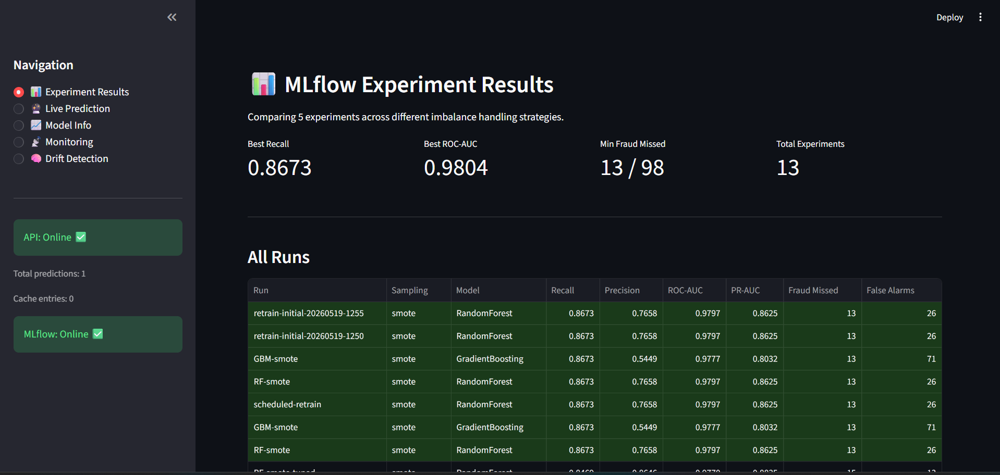

### Experiment Metrics

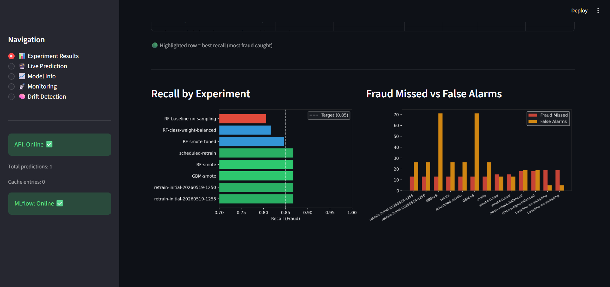

### All MLflow Runs

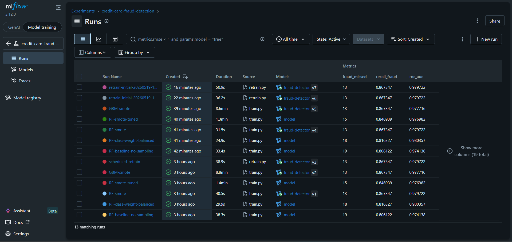

### Recall Comparison


---

# Live Prediction Dashboard

## Legitimate Transaction Prediction


## Fraud Detection Prediction


---

# Monitoring Dashboard

## Inference Monitoring

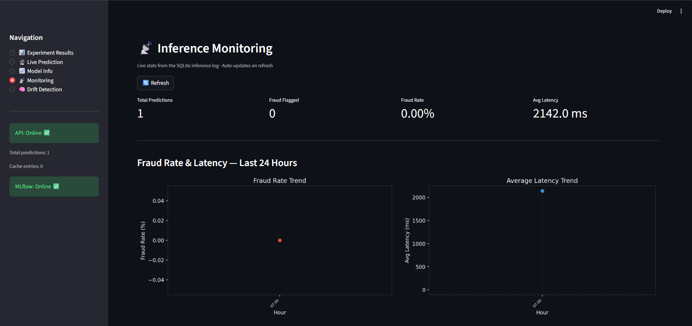

## Prediction Analytics

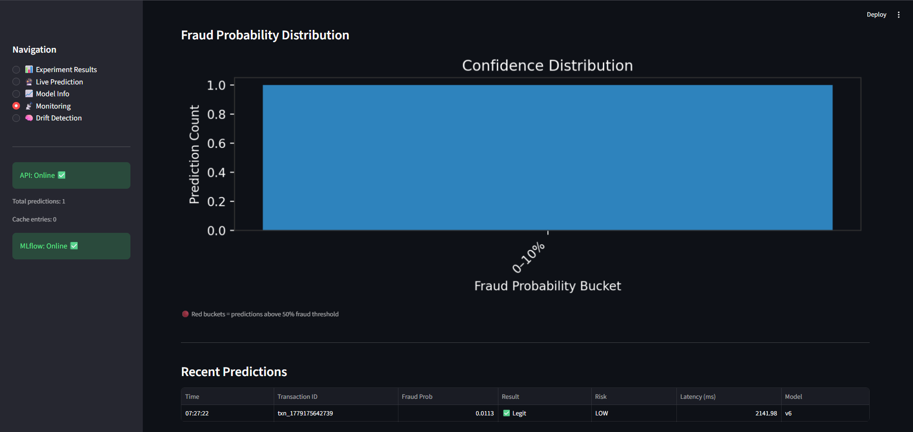

---

# Drift Detection

## Drift Analysis Dashboard

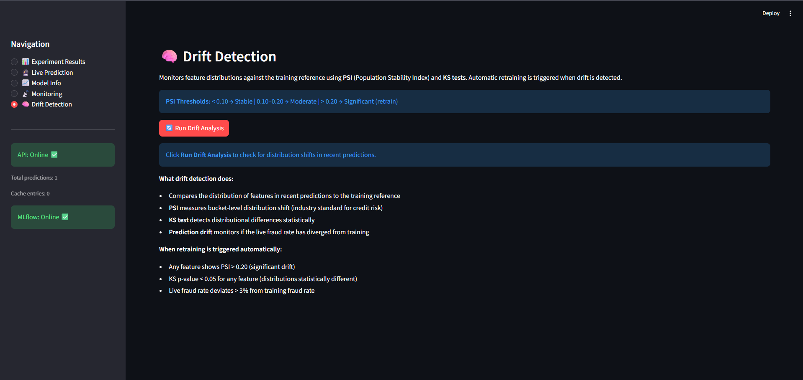

---

# Production Model Information

## Production Model Metrics

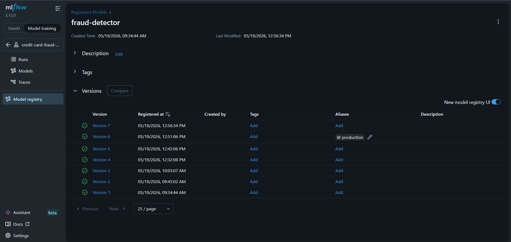

## Model Information

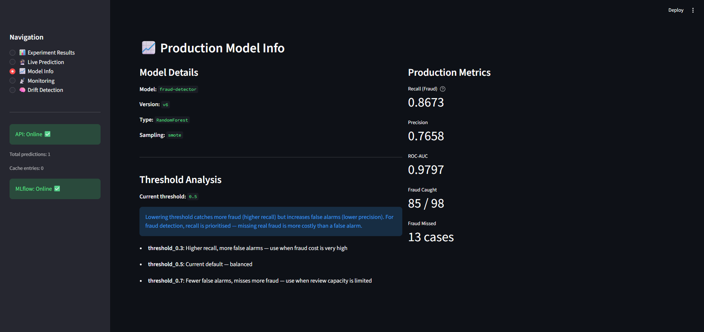

---

# Dataset Analysis

## Class Distribution

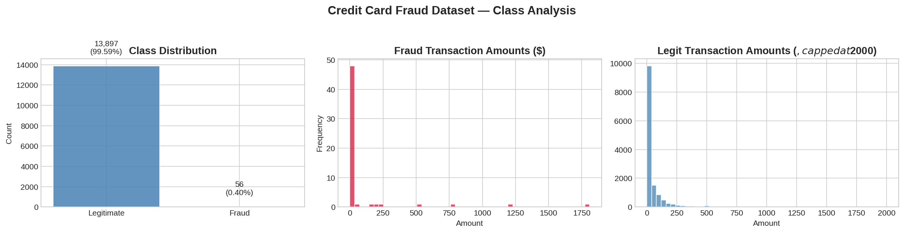

## Correlation Heatmap

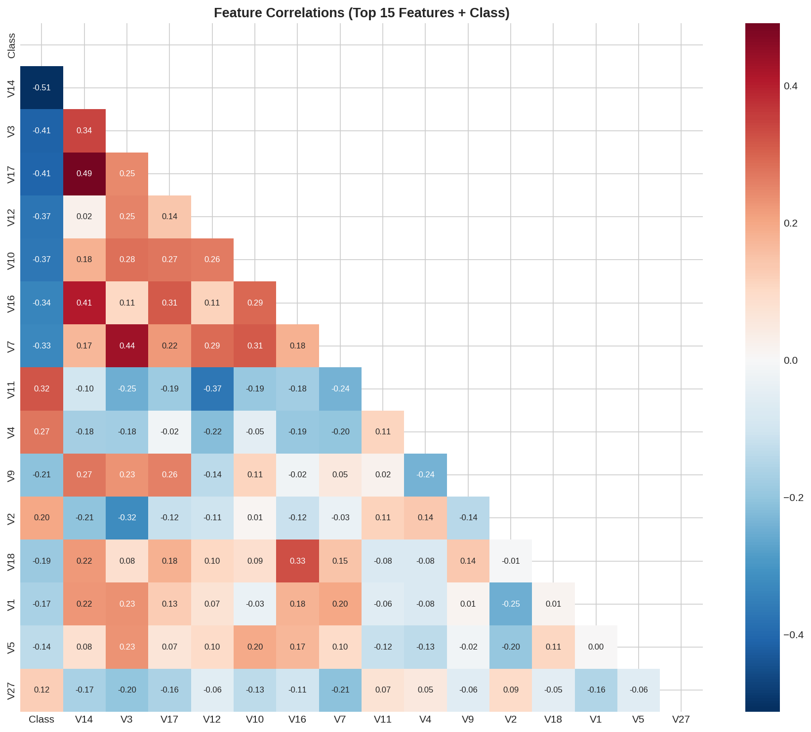

## Feature Distributions


## Time Distribution

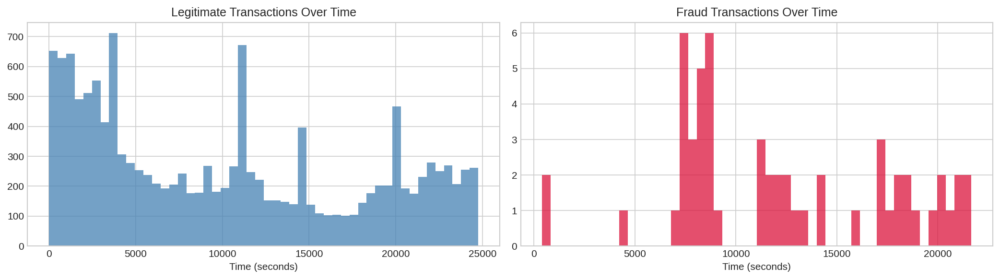

---

# Project Structure

```text
End-to-End ML Pipeline with MLflow/
│
├── api/
│   ├── main.py
│   └── inference_logger.py
│
├── dashboard/
│   └── app.py
│
├── data/
│   └── creditcard.csv
│
├── src/
│   ├── preprocess.py
│   ├── train.py
│   ├── retrain.py
│   └── drift_detector.py
│
├── Screenshots/
│
├── requirements.txt
├── docker-compose.yml
├── Dockerfile
├── scalers.pkl
├── reference_stats.json
└── README.md
```

---

# Installation

## Clone Repository

```bash
git clone https://github.com/Vaishnavi0301/End-to-End-ML-Pipeline-with-MLflow.git

cd End-to-End-ML-Pipeline-with-MLflow
```

---

# Create Virtual Environment

```bash
python -m venv venv
```

### Windows

```bash
venv\Scripts\activate
```

### Linux / Mac

```bash
source venv/bin/activate
```

---

# Install Dependencies

```bash
pip install -r requirements.txt
```

---

# Dataset

Download dataset from Kaggle:

https://www.kaggle.com/datasets/mlg-ulb/creditcardfraud

Place:

```text
creditcard.csv
```

inside:

```text
data/
```

---

# Running the Project

## 1. Start MLflow

```bash
mlflow server --host 0.0.0.0 --port 5000
```

MLflow UI:

```text
http://localhost:5000
```

---

## 2. Train Models

```bash
python src/train.py
```

This:

* runs multiple experiments
* logs metrics
* registers best models
* generates drift reference statistics

---

## 3. Set Production Alias

```bash
python -c "
import mlflow
from mlflow.tracking import MlflowClient

mlflow.set_tracking_uri('http://localhost:5000')

client = MlflowClient()

client.set_registered_model_alias(
    'fraud-detector',
    'production',
    '6'
)

print('Production alias updated')
"
```

---

## 4. Start FastAPI Server

```bash
uvicorn api.main:app --host 0.0.0.0 --port 8000 --reload
```

Swagger Docs:

```text
http://localhost:8000/docs
```

---

## 5. Start Streamlit Dashboard

```bash
streamlit run dashboard/app.py
```

Dashboard:

```text
http://localhost:8501
```

---

## 6. Start Retraining Scheduler

```bash
python src/retrain.py
```

This enables:

* scheduled retraining
* drift-triggered retraining
* automatic model comparison
* safe production promotion

---

# API Endpoints

| Endpoint             | Method | Description              |
| -------------------- | ------ | ------------------------ |
| `/predict`           | POST   | Fraud prediction         |
| `/predict-batch`     | POST   | Batch prediction         |
| `/explain`           | POST   | SHAP explanations        |
| `/health`            | GET    | API health               |
| `/model-info`        | GET    | Production model metrics |
| `/threshold-info`    | GET    | Threshold tradeoff info  |
| `/monitoring/stats`  | GET    | Monitoring statistics    |
| `/monitoring/recent` | GET    | Recent predictions       |
| `/drift-report`      | GET    | Drift analysis           |

---

# Example Prediction Request

```bash
curl -X POST http://localhost:8000/predict ^
-H "Content-Type: application/json" ^
-d "{
  \"features\": [
    -2.3122, 1.9520, -1.6099, 3.9979, -0.5222,
    -1.4265, -2.5374, 1.3917, -2.7701, -2.7723,
    3.2020, -2.8999, -0.5952, -4.2893, 0.3897,
    -1.1407, -2.8301, -0.0168, 0.4170, 0.1269,
    0.5172, -0.0350, -0.4652, 0.3202, 0.0445,
    0.1778, 0.2611, -0.1433
  ],
  \"amount\": 149.62,
  \"time\": 406
}"
```

---

# Tech Stack

| Category            | Technology          |
| ------------------- | ------------------- |
| ML Framework        | scikit-learn        |
| Imbalance Handling  | imbalanced-learn    |
| Experiment Tracking | MLflow              |
| API                 | FastAPI             |
| Dashboard           | Streamlit           |
| Explainability      | SHAP                |
| Monitoring          | SQLite              |
| Visualization       | matplotlib, seaborn |
| Containerization    | Docker              |

---

# Dataset

* 284,807 transactions
* 492 fraud cases
* 0.1727% fraud rate
* Highly imbalanced classification problem

Dataset Source:
https://www.kaggle.com/datasets/mlg-ulb/creditcardfraud

---

# Developer

### Vaishnavi

GitHub:
https://github.com/Vaishnavi0301

---

